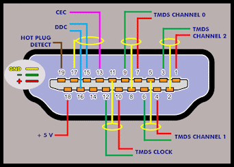
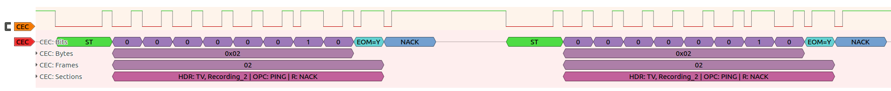
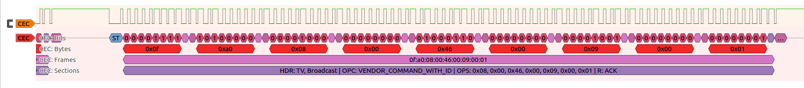

# Sigrok HDMI CEC protocol decoder
Sigrok protocol decoder for HDMI CEC (Consumer Electronics Control)

Consumer Electronics Control (CEC) is a feature of HDMI designed to allow users to command and control devices connected through HDMI

CEC Bus can be found in PIN 13 of the HDMI connector:


## Pulseview screenshots

Pulseview capture: CEC Ping frames


Pulseview capture: Vendor comand frame


## Usage examples

Print all annotations (very verbose)
```
sigrok-cli -i data.sr -P cec:CEC=CEC

cec-1: ST
cec-1: 0
cec-1: 0
cec-1: 1
cec-1: 1
cec-1: 0
cec-1: 0
cec-1: 0
cec-1: 0
cec-1: 0x30
cec-1: EOM=N
cec-1: ACK
cec-1: 0
cec-1: 0
cec-1: 0
cec-1: 0
cec-1: 0
cec-1: 1
cec-1: 0
cec-1: 0
cec-1: 0x04
cec-1: EOM=Y
cec-1: ACK
cec-1: 30:04
cec-1: HDR: Tuner_1, TV | OPC: IMAGE_VIEW_ON | R: ACK

```


Print frames only
```
sigrok-cli -i data.sr -P cec:CEC=CEC -A cec=frames

cec-1: 30:04
cec-1: 35
cec-1: 35
cec-1: 3f:82:10:00
cec-1: 30:8f
cec-1: 03:90:01
cec-1: 30:44:6d
cec-1: 35
cec-1: 35
cec-1: 30:04
cec-1: 35
cec-1: 35
cec-1: 30:0d
cec-1: 35
cec-1: 35
cec-1: 35
cec-1: 35
cec-1: 30:04
cec-1: 35
cec-1: 35
cec-1: 30:8f
cec-1: 03:90:01
cec-1: 35
cec-1: 35
cec-1: 35
cec-1: 35
cec-1: 35
cec-1: 35
cec-1: 30:04

```

Print sections only

```
sigrok-cli -i ./hdmidumps/samsung_ISSUE.sr -P cec:CEC=CEC -A cec=sections

cec-1: HDR: Tuner_1, TV | OPC: IMAGE_VIEW_ON | R: ACK
cec-1: HDR: Tuner_1, AudioSystem | OPC: PING | R: NACK
cec-1: HDR: Tuner_1, AudioSystem | OPC: PING | R: NACK
cec-1: HDR: Tuner_1, Broadcast | OPC: ACTIVE_SOURCE | OPS: 0x10, 0x00 | R: ACK
cec-1: HDR: Tuner_1, TV | OPC: GIVE_DEVICE_POWER_STATUS | R: ACK
cec-1: HDR: TV, Tuner_1 | OPC: REPORT_POWER_STATUS | OPS: 0x01 | R: ACK
cec-1: HDR: Tuner_1, TV | OPC: USER_CONTROL_PRESSED | OPS: 0x6d | R: ACK
cec-1: HDR: Tuner_1, AudioSystem | OPC: PING | R: NACK
cec-1: HDR: Tuner_1, AudioSystem | OPC: PING | R: NACK
cec-1: HDR: Tuner_1, TV | OPC: IMAGE_VIEW_ON | R: ACK
cec-1: HDR: Tuner_1, AudioSystem | OPC: PING | R: NACK
cec-1: HDR: Tuner_1, AudioSystem | OPC: PING | R: NACK
cec-1: HDR: Tuner_1, TV | OPC: TEXT_VIEW_ON | R: ACK
cec-1: HDR: Tuner_1, AudioSystem | OPC: PING | R: NACK
cec-1: HDR: Tuner_1, AudioSystem | OPC: PING | R: NACK
cec-1: HDR: Tuner_1, AudioSystem | OPC: PING | R: NACK
cec-1: HDR: Tuner_1, AudioSystem | OPC: PING | R: NACK
cec-1: HDR: Tuner_1, TV | OPC: IMAGE_VIEW_ON | R: ACK
cec-1: HDR: Tuner_1, AudioSystem | OPC: PING | R: NACK
cec-1: HDR: Tuner_1, AudioSystem | OPC: PING | R: NACK
cec-1: HDR: Tuner_1, TV | OPC: GIVE_DEVICE_POWER_STATUS | R: ACK
cec-1: HDR: TV, Tuner_1 | OPC: REPORT_POWER_STATUS | OPS: 0x01 | R: ACK
cec-1: HDR: Tuner_1, AudioSystem | OPC: PING | R: NACK
cec-1: HDR: Tuner_1, AudioSystem | OPC: PING | R: NACK
cec-1: HDR: Tuner_1, AudioSystem | OPC: PING | R: NACK
cec-1: HDR: Tuner_1, AudioSystem | OPC: PING | R: NACK
cec-1: HDR: Tuner_1, AudioSystem | OPC: PING | R: NACK
cec-1: HDR: Tuner_1, AudioSystem | OPC: PING | R: NACK
cec-1: HDR: Tuner_1, TV | OPC: IMAGE_VIEW_ON | R: ACK
cec-1: HDR: Tuner_1, AudioSystem | OPC: PING | R: NACK
cec-1: HDR: Tuner_1, AudioSystem | OPC: PING | R: NACK
cec-1: HDR: Tuner_1, TV | OPC: GIVE_DEVICE_POWER_STATUS | R: ACK
cec-1: HDR: TV, Tuner_1 | OPC: REPORT_POWER_STATUS | OPS: 0x01 | R: ACK

```


## Pending stuff